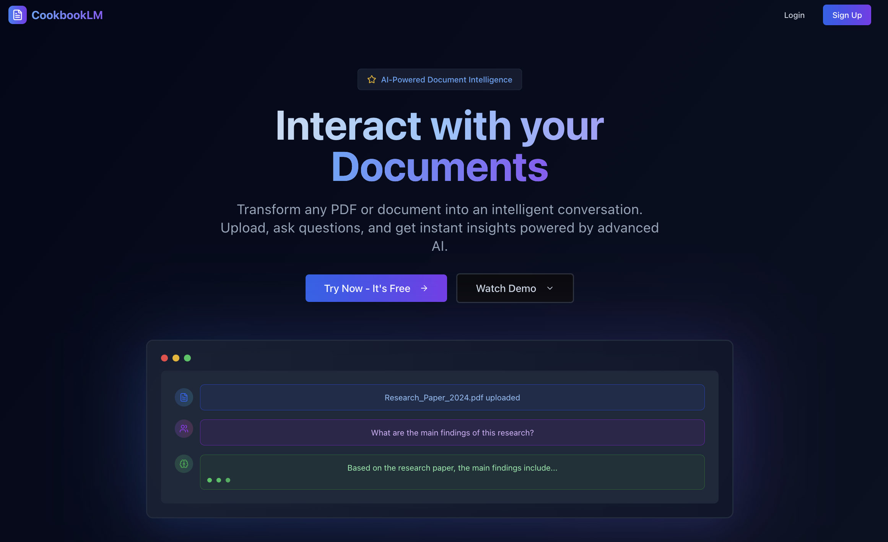

# 📚 CookbookLM



<div align="center">


</div>

---

## 🌟 Cover Page

**CookbookLM** is an open source alternative for Google's NotebookLM. It is an intelligent document processing and note-taking application that transforms your PDFs into interactive, searchable knowledge bases. Built with modern web technologies and powered by local LLMs, it provides a secure, privacy-first alternative to cloud-based document analysis tools.

### ✨ Key Features

- 📄 **PDF Processing**: Advanced OCR and table extraction
- 🤖 **AI-Powered Analysis**: Local LLM integration with Ollama & Groq
- 🗂️ **Smart Organization**: Notebook-based document management
- 💬 **Interactive Chat**: Query your documents naturally
- 📝 **Note Taking**: Rich text editor with AI-assisted writing
- 🧠 **Memory Management**: Persistent context and conversation history
- 🗺️ **Mindmap Generation**: Visual knowledge maps from documents
- � **Multi-Model Support**: Switch between Ollama and Groq models
- �🔒 **Privacy-First**: All processing happens locally (Ollama) or securely (Groq)
- 🌐 **Real-time Collaboration**: Powered by Supabase

---

## 🛠️ Tech Stack

### Frontend

- **Next.js 15** - React framework with App Router
- **TypeScript** - Type-safe development
- **Tailwind CSS** - Utility-first styling
- **Radix UI** - Accessible component primitives
- **Framer Motion** - Smooth animations

### Backend Services

- **Supabase** - Backend-as-a-Service (Auth, Database, Storage, Realtime)
- **MongoDB** - Document database for flexible data storage
- **Flask** - Python web framework for PDF processing
- **Ollama** - Local LLM inference server

### AI & Processing

- **LangChain** - LLM orchestration framework
- **Ollama** - Local LLM inference (Llama, Qwen, DeepSeek, etc.)
- **Groq** - High-speed cloud LLM inference
- **PDFPlumber** - PDF text and table extraction
- **Tesseract OCR** - Optical character recognition
- **Vector Embeddings** - Semantic search capabilities
- **Mindmap Engine** - Dynamic knowledge graph generation

### Infrastructure

- **Docker** - Containerization
- **Kong** - API Gateway
- **PostgreSQL** - Relational database (via Supabase)

---

## 📋 Prerequisites

### System Requirements

- **Node.js** 18.0 or higher
- **Python** 3.11 or higher
- **Docker** & **Docker Compose** (for containerized setup)
- **Git** for version control

### For GPU Acceleration (Optional)

- **NVIDIA GPU** with CUDA support
- **NVIDIA Container Toolkit** (for Docker GPU access)

### Development Tools

- **Code Editor** (VS Code recommended)
- **Terminal/Command Line** access

---

## 🚀 Installation

### Option 1: Docker Compose (Recommended)

#### Quick Start

```bash
# Clone the repository
git clone https://github.com/krishmakhijani/cookbookLM.git
cd cookbookLM

# Start all services
docker-compose up -d

# Access the application
open http://localhost:3000
```

#### Service URLs

- **Web App**: http://localhost:3000
- **Supabase Studio**: http://localhost:54323
- **API Gateway**: http://localhost:54321
- **PDF Parser**: http://localhost:5000
- **MongoDB**: localhost:27017
- **Ollama**: http://localhost:11434

#### Download LLM Models

```bash
# Download popular models
docker-compose exec ollama ollama pull llama3.2
docker-compose exec ollama ollama pull qwen2.5:7b
docker-compose exec ollama ollama pull deepseek-coder
```

### Option 2: Manual Setup

#### 1. Clone & Setup

```bash
git clone https://github.com/krishmakhijani/cookbookLM.git
cd cookbookLM
```

#### 2. Database Setup

```bash
# Install and start Supabase CLI
npm install -g @supabase/cli
cd infrastructure/supabase
supabase start

# Install and start MongoDB
brew install mongodb/brew/mongodb-community
brew services start mongodb/brew/mongodb-community
```

#### 3. Ollama Setup

```bash
# Install Ollama
curl -fsSL https://ollama.ai/install.sh | sh

# Start Ollama service
ollama serve

# Download models (in another terminal)
ollama pull llama3.2
ollama pull qwen2.5:7b
```

#### 4. PDF Parser Service

```bash
cd pdfParserService

# Create virtual environment
python -m venv venv
source venv/bin/activate  # On Windows: venv\Scripts\activate

# Install dependencies
pip install -r requirements.txt

# Install system dependencies (macOS)
brew install tesseract poppler

# Start the service
python app.py
```

#### 5. Web Application

```bash
cd web-app

# Install dependencies
npm install
# or
bun install

# Set up environment variables
cp .env.example .env.local
# Edit .env.local with your configuration

# Start development server
npm run dev
# or
bun dev
```

#### Environment Variables

Create `.env.local` in the web-app directory:

```env
# Supabase Configuration
NEXT_PUBLIC_SUPABASE_URL=""
SUPABASE_GRAPHQL_URL=""
SUPABASE_S3_STORAGE_URL=""
SUPABASE_DB_URL=""
SUPABASE_INBUCKET_URL=""
SUPABASE_JWT_SECRET=""
NEXT_PUBLIC_SUPABASE_ANON_KEY=""
SUPABASE_SERVICE_ROLE_KEY=""
SUPABASE_S3_ACCESS_KEY=""
SUPABASE_S3_SECRET_KEY=""
SUPABASE_S3_REGION="local"
MONGODB_URL=""
DEVELOPMENT_URL=""
OLLAMA_BASE_URL=""
GROQ_API_KEY=""
```

---

## ⚖️ CookbookLM vs NotebookLM

| Feature                     | CookbookLM                                    | NotebookLM                      |
| --------------------------- | --------------------------------------------- | ------------------------------- |
| **Privacy & Data Control**  | ✅ Complete local processing                  | ❌ Cloud-based processing       |
| **Offline Functionality**   | ✅ Works entirely offline (with Ollama)       | ❌ Requires internet connection |
| **Custom LLM Models**       | ✅ Support for any Groq Model or Ollama Model | ❌ Limited to Google's models   |
| **Note Taking System**      | ✅ Rich text editor with AI assistance        | ✅ Basic note creation          |
| **Memory Management**       | ✅ Persistent conversation history            | ❌ Limited session memory       |
| **Mindmap Generation**      | ✅ Dynamic visual knowledge maps              | ❌ No mindmap feature           |
| **Multi-Provider AI**       | ✅ Ollama + Groq integration                  | ❌ Google models only           |
| **Open Source**             | ✅ Fully open source                          | ❌ Proprietary                  |
| **Self-Hosting**            | ✅ Deploy anywhere                            | ❌ Google Cloud only            |
| **PDF OCR Processing**      | ✅ Advanced OCR with Tesseract                | ✅ Good PDF processing          |
| **Table Extraction**        | ✅ Structured table parsing                   | ✅ Structured table parsing     |
| **Real-time Collaboration** | ✅ Supabase real-time features                | ✅ Google Workspace integration |
| **Document Chat**           | ✅ AI conversation                            | ✅ AI conversation              |
| **Note Organization**       | ✅ Flexible notebook system                   | ✅ Notebook organization        |
| **Vector Search**           | ✅ Semantic search capabilities               | ✅ AI-powered search            |
| **Multi-language Support**  | ✅ Configurable via models                    | ✅ Google's language support    |
| **API Access**              | ✅ Full REST API                              | ❌ Limited API access           |
| **Customization**           | ✅ Highly customizable                        | ❌ Limited customization        |
| **Cost**                    | ✅ Free (compute costs only)                  | ❌ Usage-based pricing          |

### 🎯 Why Choose CookbookLM?

- **🔒 Privacy First**: Your documents never leave your infrastructure (Ollama) or use secure APIs (Groq)
- **💰 Cost Effective**: No subscription fees, pay-per-use with Groq or free with Ollama
- **🛠️ Customizable**: Modify and extend according to your needs
- **🌍 Offline Ready**: Work without internet connectivity using Ollama models
- **🤖 Model Freedom**: Use any Ollama model locally or Groq's optimized models
- **📊 Data Ownership**: Complete control over your data and processing
- **🧠 Smart Memory**: Persistent context across sessions for better conversations
- **🗺️ Visual Learning**: Generate mindmaps to understand document relationships

---

## 🤖 AI Models & Features

### Supported AI Providers

#### Ollama (Local Processing)

- **Custom Models** - Load any GGUF model

#### Groq (Cloud Processing)

- **OpenAI OSS 120B** - Latest OpenAI OSS models with high speed
- **Deepseek R1** - Mixture of experts architecture
- **Qwen 2.5** - Google's open models
- **High-Speed Inference** - Optimized for real-time responses

### Core Features

#### 📝 Advanced Note Taking

- **Rich Text Editor** with markdown support
- **AI-Assisted Writing** suggestions and completions
- **Smart Formatting** automatic structure detection
- **Cross-References** link notes to document sections
- **Template System** for consistent note organization

#### 🧠 Memory Management

- **Conversation History** persistent across sessions
- **Context Awareness** remembers document relationships
- **User Preferences** adapts to your writing style
- **Smart Summarization** of long conversations
- **Knowledge Graph** builds connections between concepts

#### 🗺️ Mindmap Generation

- **Document Mapping** visual representation of content structure
- **Concept Extraction** automatic identification of key topics
- **Relationship Visualization** shows connections between ideas
- **Interactive Navigation** click to jump to document sections
- **Export Options** save as image or interactive formats
- **Collaborative Editing** real-time mindmap sharing

---

## 📖 Usage

1. **Upload Documents**: Drag and drop PDF files to create new notebooks
2. **AI Processing**: Documents are automatically processed and indexed with OCR and table extraction
3. **Interactive Chat**: Ask questions about your documents using Ollama or Groq models
4. **Smart Notes**: Create and organize notes with AI-assisted writing and suggestions
5. **Memory Management**: Build persistent context that remembers your preferences and conversation history
6. **Mindmap Visualization**: Generate interactive mindmaps to visualize document relationships and concepts
7. **Model Selection**: Switch between local Ollama models and high-speed Groq models based on your needs
8. **Collaboration**: Share notebooks with team members in real-time using Supabase

---

## 🤝 Contributing

We welcome contributions! Please see our [Contributing Guide](CONTRIBUTING.md) for details.

## 📄 License

This project is licensed under the MIT License - see the [LICENSE](LICENSE) file for details.

---

<div align="center">
  <p>Built with ❤️ for privacy-conscious knowledge workers</p>
  <p>
    <a href="https://github.com/krishmakhijani/cookbookLM">⭐ Star us on GitHub</a> |
  </p>
</div>
